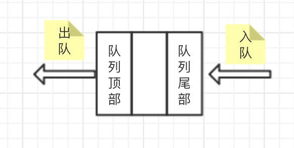

### 数据结构
---
#### 栈
1.  **栈的定义**

    栈：栈是一种遵从后进先出（LIFO）原则的有序集合。如下图所示，先进去的数据在底部，最后取出，后进去的数据在顶部，最先被取出。
    
    

2.  **常用方法**
    +   `push(element)`：添加一个或者多个元素到栈顶
    +   `pop()`：移除栈顶的元素，同时返回该元素
    +   `peek()`：查看栈顶的元素
    +   `isEmpty()`：判断栈是否空了，是则返回`true`，否则返回`false`
    +   `clear()`：清除栈中的所有元素
    +   `size()`：返回栈里的元素个数，方法和`length`类似

3.  **运用场景**
    +   进制转换
        1.  已知 10 进制的数为 n。
        2.  将 n 每次取余 2 的值放入栈底部。
        3.  将 n 每次除于 2 的值当成下一次循环的数字（向下取整，舍弃小数部位）。
        4.  循环步骤 2 和步骤 3，直至 n 等于 0 为止。
        5.  将栈的数值依序推出来，从而得到最终结果。
    +   括号匹配
        
        拿` ()[]{} `举例：
        1.  判断 ( 不是闭合括号，所以推入栈，stack = [ '(' ]；
        2.  判断 ) 是闭合括号，所以推出栈，stack = []；
        3.  判断 [ 不是闭合括号，所以推入栈，stack = [ '[' ]；
        4.  判断 ] 是闭合括号，所以推出栈，stack = []；
        5.  判断 { 不是闭合括号，所以推入栈，stack = [ '{' ];
        6.  判断 } 是闭合括号，所以推出栈，stack = []；
    
---
#### 队列
1.  **队列的定义**
    
    队列：队列与栈结构类似，队列是遵循先进先出原则的一组有序的项，与栈不同的是，栈不管是入栈还是出栈操作都是在栈顶操作。而队列则是在队尾添加元素，队顶移出。如下图所示：
       
    
    
    优先级队列：在队列的基础上，每个元素都会有各自的优先级，在插入的时候会根据优先级的高低顺序进行插入操作。入队时如果队列为空直接加入队列，否则进行比较，优先级越高（较小的数字具有较高优先级）的放在队列的越前面，如下图所示：
    
    

   
2.  **常用方法**
    +   `enqueue(element)`：添加一个或者多个元素到队列尾部
    +   `dequeue()`：移除队列的第一(即排在队列最前面的)项，并返回被移除的元素
    +   `front()`：返回队列中第一个元素——最先被添加，也将是最先被移除的元素。队列不做任何改动
    +   `isEmpty()`：判断队列中是否包含元素，是则返回`true`，否则返回`false`
    +   `size()`：返回队列中的元素个数，方法和`length`类似

3.  **运用场景**   
    +   约瑟夫环（丢手绢）
        
        约瑟夫问题是个有名的问题：N个人围成一圈，从第一个开始报数，第M个将被杀掉，最后剩下一个，其余人都将被杀掉。例如N=6，M=5，被杀掉的顺序是：5，4，6，2，3。
        
        可以将参与游戏的人压入队列中，从头开始报过数的人出队列，然后从队尾进入队列。当到报数序号时，将队列头部元素进行出列，循环直至最后一人。
    
---
#### 链表
1.  **链表的定义**

    链表是一种物理存储单元上非连续、非顺序的存储结构。链表由一系列结点组成，结点可以在运行时动态生成。每个结点包括两个部分：一个是存储数据元素的数据域，另一个是存储下一个结点地址的指针域。

2. **常用方法**

    +   `append(data)`：在链表尾部插入新结点
    +   `insert(position,data)`：在指定位置插入结点
    +   `removeAt(position)`：通过指定位置删除结点
    +   `indexOf(data)`：返回结点在链表中所处的位置
    +   `remove(data)`：删除链表中的结点 
    +   `isEmpty()`：判断链表中是否包含结点，是则返回`true`，否则返回`false`
    +   `indexOf(data)`：返回结点在链表中所处的位置
    +   `size()`：返回链表中的结点个数，方法和`length`类似

3.  **链表分类**

    +   单向链表
        
        用一组任意的内存空间去存储数据元素，每个节点(node)都由数据本身和一个指向后续节点的指针组成，整个链表的存取必须从头指针开始，头指针指向第一个节点，最后一个节点的指针指向空（NULL）。
        
    +   单向循环链表
        
        在单向链表的基础上，最后一个节点的的指针指向链表头部，而不是NULL。
        在单向链表的基础上
         
    +   双向链表
        双向链表在单向链表的基础上每个节点都有一个指向上一个节点的指针(prev)与指向下一个节点的指针(next)。
        
    +   双向循环链表

    在双向链表的基础上，最后一个节点的后指针指向头结点，头结点的前指针指向尾部节点。
    

---
#### 集合
1.  **集合的定义**

    集合是由一组无序但彼此之间又有一定相关性的成员构成的, 每个成员在集合中只能出现一次.他是一个无序且唯一的数据结构。ES6提供了集合的数据结构实现`Set`

2.  **常用方法**
    
    +   `add(value)`：为集合对象添加成员，已有该成员则不添加。方法返回对象本身。
    +   `clear()`：清除集合中所有成员。
    +   `delete(value)`：删除集合中指定对象。删除成功则返回`true`，否则返回`false`。
    +   `has(value)`：判断对象内是否含有该值。
    +   `values()`：返回一个新生成的可迭代对象，其顺序与插入 Set 对象时的顺序相同。 
    +   `keys()`：与values()方法的返回结果一致。
    +   `forEach(callback[, thisArg])`：按顺序都执行提供的 callback 函数一次。值得注意的是，set 对象的只有"值"，可以理解为键值相等，所以 callback 的第一第二个参数是一致的。
    +   `entries()`：返回一个新的包含 `[value, value]` 形式的数组迭代器对象，顺序与`forEach()`方法一致。

3.  **补充**

    +   转换数组
    
        >const set = new Set([1,2,3,4])
        >const arr = Array.from(set)
        >const arr2 = [...set]
        
    +   合并数组去重
 
        >const arr1 = [1,2,3,4]
        >const arr2 = [2,3]
        >const set  = new Set([...arr1,...arr2])
        >const concatArr = [...set]
        
    +   并集与交集实现
        
        >//并集
        >const set1=new Set([1,2,4])
        >const set2=new Set([2,3,4,5])
        >const set3=new Set([...arr1, ...arr2])
        >//交集
        >const arr1=new Set([1,3,4,6,7,9])
        >const arr2=new Set([2,3,4,5,6,7])
        >const arr=new Set([...arr1].filter((item)=>{arr2.has(item)}))        
        
    +   WeekSet
    
        `WeakSet`对象允许你将弱保持对象存储在一个集合中。`WeakSet` 结构与 `Set` 类似，也是不重复的值的集合。
        `WeakSet` 与 `Set` 区别如下:
        +   WeakSet 的成员只能是对象，而不能是其他类型的值。
        +   WeakSet 中的成员都是弱引用，即垃圾回收机制不考虑 WeakSet 对该对象的引用，也就是说，如果其他对象都不再引用该对象，那么垃圾回收机制会自动回收该对象所占用的内存，不考虑该对象还存在于 WeakSet 之中。
        +   WeakSet 中`clear`方法不可用。
        +   WeakSet 对象不能遍历，所以keys()、values()、entries()、forEach()、clear()、size这些属性方法都没有。
    
---  
#### 字典
1.  **字典的定义**
    
    字典 是一种以键-值对形式存储唯一数据的数据结构。ES6提供了字典的数据结构实现`Map`
       
2.  **常用方法**
    
    +   `get(key)`：返回字典中key对应的value，如果不存在，则返回undefined。
    +   `set(key,value)`：为字典对象添加成员，已有key，则会覆盖之前key的value值。
    +   `has(key)`：用于检查字典中是否有指定key对应的value。
    +   `clear()`：用于清空指定字典对象中的所有内容。
    +   `delete(key) `：用于删除字典中指定key对应的一组key-value元素，删除成功则返回`true`，否则返回`false`。
    +   `keys()`：返回字典对象中每个元素的key构成的一个可迭代对象。
    +   `values()`：和keys方法对应，values方法返回的就是字典对象中的value集合构成的迭代器对象。。 
    +   `forEach(callback[, thisArg])`：按顺序都执行提供的 callback 函数一次。
    +   `entries()`：返回一个新的包含 `[key, value]` 形式的数组迭代器对象。
    
3.  **补充**

    +   Map与原生对象的区别
    
        +   Map与原生对象都是存储键值对的集合，但原生对象中的键值是`String`类型，Map可为任意类型
        
        +   常规对象里，为了遍历keys、values和entries，你必须将它们转换为数组，如使用Object.keys()、Object.values()和Object.entries()，或使用for ... in，另外for ... in循环还有一些限制：它仅仅遍历可枚举属性、非Symbol属性，并且遍历的顺序是任意的。但Map可直接遍历，且因为它是键值对集合，所以可直接使用for…of或forEach来遍历。
    
    +   WeekMap
    
        `WeakSet` 结构与 `Map` 类似，也是不重复的值的集合，但其中的键是弱引用对象。
        `WeakSet` 与 `Set` 区别如下:
        +   WeakMap 的成员中的键值只能是对象，而不能是其他类型的值。
        +   WeakMap 中，每个键对自己所引用对象的引用都是弱引用，在没有其他引用和该键引用同一对象，这个对象将会被垃圾回收（相应的key则变成无效的），所以，WeakMap 的 key 是不可枚举的。
        +   WeakSet 中`clear`方法不可用。
        +   WeakSet 对象不能遍历，所以keys()、values()、entries()、forEach()、clear()、size这些属性方法都没有。
